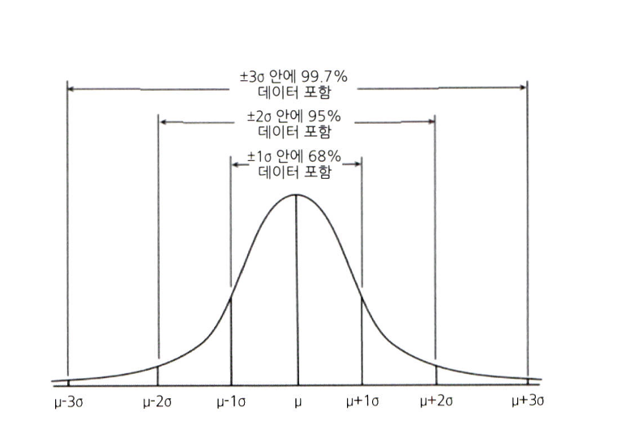

# 통계학 1주차 정규과제

📌통계학 정규과제는 매주 정해진 분량의 『*데이터 분석가가 반드시 알아야 할 모든 것*』 을 읽고 학습하는 것입니다. 이번 주는 아래의 **Statistics_1st_TIL**에 나열된 분량을 읽고 `학습 목표`에 맞게 공부하시면 됩니다.

아래의 문제를 풀어보며 학습 내용을 점검하세요. 문제를 해결하는 과정에서 개념을 스스로 정리하고, 필요한 경우 추가자료와 교재를 다시 참고하여 보완하는 것이 좋습니다.

1주차는 `1부. 데이터 기초체력 기르기`를 읽고 새롭게 배운 내용을 정리해주시면 됩니다.


## Statistics_1st_TIL

### 1부. 데이터 기초체력 기르기
### 01. 통계학 이해하기
### 02. 모집단과 표본추출
### 03. 변수와 척도
### 04. 데이터의 기술 통계적 측정
### 05. 확률과 확률변수

## Study Schedule

|주차 | 공부 범위     | 완료 여부 |
|----|----------------|----------|
|1주차| 1부 p.2~56     | ✅      |
|2주차| 1부 p.57~79    | 🍽️      | 
|3주차| 2부 p.82~120   | 🍽️      | 
|4주차| 2부 p.121~202  | 🍽️      | 
|5주차| 2부 p.203~254  | 🍽️      | 
|6주차| 3부 p.300~356  | 🍽️      | 
|7주차| 3부 p.357~615  | 🍽️      | 

<!-- 여기까진 그대로 둬 주세요-->

# 01. 통계학 이해하기

```
✅ 학습 목표 :
* 통계학의 필요성에 대해 인식한다.
* 기술통계와 추론통계의 특성을 구분할 수 있다.
```
1.1 왜 통계학을 알아야 할까?    
       

1.2 머신러닝과 전통적 통계학의 차이        
머신러닝의주된목적 : 예측(Prediction) / 미래를예측하고, 모델에 기반한 정확한 분류나 선택을 하는것             
통계학의주된목적 : 해석(explanation) / 과거와 현재 데이터를 활용하여 현상을 해석하고 의미를 찾는        
통계학은 모델의 기초체력과 같은것 => 이를 통해 복잡하고 정교한 머신러닝 모델을 제작      
          

1.3 통계학의 정의와 기원       
통계학(statistics) :  자료를수집, 분석하여 그 분석결과를통해 효율적인 의사결정을 하는 기법을 연구하는 학문         
인구조사하면서 생겨남 ...     

1.4 기술 통계와 추론 통계       
1.4.1 기술 통계(descriptive statistic)       
- 문자 그대로 주어진 데이터 특성을 사실에 근거하여 설명하고 묘사하는 것     
- 전체 데이터를 쉽고 직관적으로 파악할 수 있도록 설명해주는 것    
- ex) 대푯값(키 평균값 제공 등)     
- 기술 통계를 내는 것 => eda(exploratory data analysis)     
- 시각화 사용    

1.4.2 추론 통계(inferential statistic)    
- 표본 집단으로부터 모집단의 특성을 추론하는 것이 목적     
- eda를 통해 본격적으로 머신러닝 모델 만들고 예측/분류 진행    
- ex) 한 학급 통계치로 학교 전체의 통계치를 추정하는 것     


# 02. 모집단과 표본추출

```
✅ 학습 목표 :
* 모집단과 표본의 정의와 관계를 설명할 수 있다.
* 편향과 분산의 차이를 설명할 수 있다.
```
2.1 모집단과 표본, 전수조사와 표본조사     
모집단(population) : 분석 대상 전체의 집합    
표본(sample) : 모집단 일부 추출    
전수조사 :  모집단의 자료전체를 조사 및 분석하여 정보를 추출하는것    
표본조사 : 모집단에서 추출한 표본을 통해 모집단 정보 추정, 검정      
     

2.2 표본조사를 하는 이유와 데이터과학 적용 방법     
최종 분석에는 전체 데이터를 사용하더라도, 분석 모델이 완성될 때 까지는 표본데이터를 활용하는 게 경제적, 시간적으로 유리     
표지 재포획법(marking and recaputre method) : 관악구 길고양이 100마리 포획 후 marking, 두번째 100마리 포획 후 marking 되어있는 길고양이 수 확인 
=>     
N : 처음 포획한 길고양이      
n : 두번째 포획 중 marking 남아있는 길고양이 수       

2.3 표본추출에서 나타나는 편향의 종류     
표본 오차 : 모집단과 표본의 자연 발생적인 변동       
ex) 우연, 표본수의 부족      
비표본 오차 : 자연 발생적인 표본 오차를 제외한 변동      
ex) 조사원의 미숙, 자료의 그릇된 해석      
편향(bias) : 표본에서 나타나는 모집단과의 체계적인 차이        

표본 추출 과정에서의 대표적인 편향     
        
 => 확률화(randomization) 등을 통해 최소화     

2.4 인지적 편향의 종류     
인지적 편향(cognitive bias) : 분석가의 성향에 따라 비논리적인 추론을 내리는 패턴    
2.4.1 확증편향(confirmation bias)         
: 자신이 본래 믿고 있는 대로 정보를 선택적으로 받아들이고 임의로 판단하는 편향        
2.4.2 기준점 편향(anchoring bias)         
: 분석가가 가장 처음에 접하는 정보에 지나치게 매몰되는 편향            
2.4.3 선택 지원 편향(choice-supportive biias)      
: 본인이 의사 결정을 내리는 순간 그선택의 긍정적인 부분에 대해 더 많이 생각하고 그 결정에 반대되는 증거를 무시하게 되는 편향      
2.4.4 분모 편향(denominator bias)        
: 분수 전체가 아닌 분자에만 집중하여 현황을 왜곡하여 판단하게 되는 편향       
2.4.5 생존자 편향(survivorship bias)        
: 소수의 성공한 사례를 일반화된 것으로 인식함으로써 나타나는 편향       

2.5 머신러닝 모델 측면의 편향과 분산       
편향 : 예측값들이 정답과 일정하게 차이가 나는 정도           
분산 : 주어진 데이터 포인트(예를들어평균)에대한 모델예측의 가변성       
      
편향과 분산은 트레이드 오프 관계      
=> 예측이나 분류모델을 만들 때 주어진 학습데이터에 잘 맞도록 모델을 만들수록 편향은 줄어들고 분산은 증가할 수 밖에 없다.        


오른쪽 상단 : 대표적 머신러닝 모델 형태(모델 복잡성이 커서 과적합 발생한거 ㅇㅇ)      
왼쪽 하단 : 정답 설명 변수 부족한 상태      

2.6 표본 편향 최소화하기 위한 표본 추출 방법        
복원추출/비복원추출       
단순 임의 추출방법 : 랜덤띠        
계층적 표본추출 방법 : 모든 구성단위에 일련번호를 부여한 뒤 일정한 간격으로 표본을 선택하는 방법(주기성 있을 시 대표성 결여)        
층화 표본추출방법 : 모집단이 특정한 기준으로 분류가 가능할 때 쓰일 수 있는 방법         
군집 표본추출방법 : 층화표본추출방법처럼 모집단을 특정한 기준으로 분류한 뒤, 그 중 하나의 소집단을 선택하여 분석하는 방법     
    
# 03. 변수와 척도
```
✅ 학습 목표 :
* 독립변수, 종속변수의 관계를 파악할 수 있다.
* 척도(변수의 데이터적 속성)의 종류를 설명할 수 있다.
```
3.1 변수의 종류      
     

3.2 변수 관계의 종류     
인과관계(casual relationship)       
: 독립변수와 종속변수의 기본적 관계      
상관관계(correlational relationship)       
: 변수간에 관련성이 존재하는 관계, 인과관계 상위개념        
독립관계(independent relationship)       
: 변수 간에 상관성, 즉 상관계수가 0인 관계       
의사관계(spurious relationship)       
: 변수 간에 상관성은 있지만, 그 상관성이 다른 변수에 의해 나타난 관계 (아이스크림 판매량, 익사사고 발생수 제3의 변수 : 기온 )          
양항향적 인과관계(reciprocal causality)       
: 두 변수가 서로간에 인과적 영향을 미치는 관계        
조절관계(moderating relationship)      
: 독립변수와 종속변수 사이에서 강하고 불확정적인 영향을 미치는 관계        
매개관계(mediational relationship)      
: 독립변수와 종속변수의 중간에서 매개변수가 개입되어 독립변수의 영향을 종속변수에 전달하는 관계(시간적 차원 포함o)      
조절관계/매개관계 : 조졀관계는 독립변수와 종속변수 간 관계의 강도를 조절해주는 역할, 매개관계는 독립변수의 영향을 종속변수로 전달하는 역할(매개는 조절과 달리 독립,종속변수랑 직접 영향을 주고받음)          

3.3 척도의 종류      
     
명목척도(nominal scale)
:조사대상의 속성이나 범주를 구분하기 위한 목적으로 만들어진 척도          
서열척도(ordinal scale)       
: 조사 대상의 속성크기를 측정하여 대상간의 순서관계를 측정하는 척도       
등간척도(interval scale) 
: 서열척도가 가지고 있는 정보와함께 조사대상이 가지고 있는 속성의 상대적 크기의 차이를 비교할 수 있는 정보도 가지고 있음, 속성 간의 상대적 차이 가감 가능, 절대적 기준점 없음         
비율척도(ratio scale) : 순서에 관한 정보, 대상 간 상대적 크기정보 그리고 절대적 기준을 통한 비율정보까지 포함하고있음.(가장 많은 정보 담고있음)       

# 04. 데이터의 기술 통계적 측정

```
✅ 학습 목표 :
* 산포도의 의미를 설명하고 측정방법을 나열할 수 있다.
* 정규분포의 왜도값과 첨도값이 얼마인지 답할 수 있다.
```
4.1 중심 성향의 측정       
중심 성향 - 평균값, 최빈값(명목,서열 척도에서 사용 가능), 중앙값        
산술평균/가중평균       
기하평균(시간에 따라 비율적으로 변화하는 값의 평균 구함)      
조화평균(시간적으로 변화하는 데이터에서 평균을 측정하는 방법)          
기하평균 : 비율의 평균값      
조화평균 : 값의 평균값         

4.2 분산과 표준편차      
- 퍼진 정도를 파악하는 지표     
분산 : 산술평균과 각 데이터의 편차를 제곱한 것의 평균     

자유도?
- . 모집단의 분산이나 표준편차를 구할때는 모집단의 수 전체(N)가 자유도가 된다. 하지만 표본의 경우에는 모집단의평균(u)이 아닌 표본평균(X)을 통해 통곗값을 산출한다. 그래서 전체 관측치 중 하나는 정해진 표본평균을 맞춰줘야하기 때문에 자유도를 박탈당한다. 

4.3 산포도와 범위, 사분위수, 변동계수      
산포도 : 대푯값을 중심으로 자료들이 흩어져 있는 정도를 의미     
산포도 측정 방법 : 범위, 분산, 표준편차, 사분위수 범위, 변동계수 등     
변동계수(coefficient of variation) : 표준편차를 산술평균으로 나누어 준 값. 각 자료의 표준편차와 평균 함께 활용 => 서로 다른 자료의 산포도를 비교할 수 있음      

4.4 왜도와 첨도      
4.4.1 왜도       
데이터의 분포의 좌우 비대칭도를 표현하는 척도       
왜도값이 작다 : 정규분포처럼 분포가 좌우대칭을 이룸     
왜도값이 크다 : 한쪽으로 심하게 몰려있다.       
4.4.2 첨도       
분포가 정규분포보다 얼마나 뾰족하거나 완만한지의 정도를 나타내는 척도      
음수 : 분포가 넓게 퍼져있음      
양수 : 뾰족한 형태의 분포     

4.5 표준편차의 경험법칙     
      


# 05. 확률과 확률변수

```
✅ 학습 목표 :
* 확률변수의 개념과 종류를 설명할 수 있다.
* 심슨의 역설을 설명하고, 발생 원인을 식별하며, 이를 해결하기 위한 방안을 도출할 수 있다.
```
5.2 확률의 종류
비조건확률(unconditional prob)      
결합 확률(join prob) : 두 개 이상의 사건이 동시에 일어나는 확률      
조건부 확률(conditional prob)        
5.3 분할과 베이지안 이론       
베이지안 이론 : 
"사건 발생 전에 이미 가지고 있는 사전 확률 p(A)와
우도'확률p(BIA)를 안다면 사후확률 p(AIB)를 계산할 수 있다."     
5.4 확률변수의 개념과 종류         
이산확률변수/연속확률변수       

5.5 심슨의 역설       
데이터를 어떻게 나누고 결합하고 가공하는가에 따라 결과가 정반대로 바뀔 수 있음을 경계해야함      
ex)
여성의 합격률이 낮다고 주장     
=> 여성들이 높은 경쟁률의 학과에 남성들은 경쟁률이 낮아 합격률이 높은 학과에 지원.        
=> 개별 학과의 합격률은 여성이 높았음        

6.1 확률분포의 정의와 종류       
이산확률분포(discrete probability distribution) => 확률질량함수 pmf     
균등분포, 이항분포(binomial), 초기하분포(비복원추출), 포아송분포, 
연속확률분포(continous probalility distribution) => 확률밀도함수 pdf           
정규분포, 지수분포(특정사건이 발생한 시점으로부터 다음사건이 발생할 때 까지의 시간을 확률변숫값으로 하는 분포를 뜻한다),  

6.4 중심극한 정리     
데이터의 크기가 일정한 양(30)을 넘으면, 평균의 분포는 정규분포에 근사한다는 이론.     


<br>
<br>

# 확인 문제

## 문제 1.

> **🧚Q. 한 대형 병원이 두 명의 외과 의사(A와 B)의 수술 성공률을 비교하려고 한다. 과거 1년간의 데이터를 보면, A 의사의 전체 수술 성공률은 80%, B 의사의 전체 수술 성공률은 90%였다. 이 데이터를 본 병원 경영진은 A 의사의 실력이 B 의사보다 별로라고 판단하여 A 의사의 수술 기회를 줄이는 방향으로 정책을 조정하려 한다.
그러나 일부 의료진은 이 결론에 의문을 제기했다.
그들은 "단순한 전체 성공률이 아니라 더 세부적인 데이터를 분석해야 한다"고 주장했다.**

> **-A 의사의 실력이 실제로 B 의사보다 별로라고 결론짓는 것이 타당한가?   
-그렇지 않다면, 추가로 확인해야 할 정보는 무엇인가?**

<!--심슨의 역설을 이해하였는지 확인하기 위한 문제입니다-->

<!--학습한 개념을 활용하여 자유롭게 설명해 보세요. 구체적인 예시를 들어 설명하면 더욱 좋습니다.-->

```
타당하지 않다고 생각함.     
수술의 난이도와 시행한 수술의 총 횟수 등 다양한 요인들을 모두 고려해보아야 한다고 생각함. 
```

### 🎉 수고하셨습니다.
