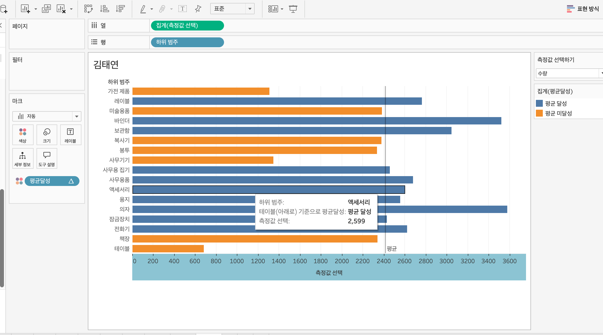

# Second Study Week

- 10강: [차원과 측정값](#10강-차원과-측정값)

- 11강: [시각화](#11강-시각화)

- 12강: [막대그래프](#12강-막대그래프)

- 13강: [누적막대그래프](#13강-누적막대그래프)

- 14강: [병렬막대그래프](#14강-병렬막대그래프)

- 15강: [누적병렬막대그래프](#15강-누적병렬막대그래프)

- 16강: [라인그래프](#16강-라인그래프)

- 17강: [맵작성](#17강-맵작성)

- 18강: [텍스트테이블](#18강-텍스트테이블)

- 19강: [트리맵과 하이라이트테이블](#19강-트리맵과-하이라이트테이블)

- 문제1 : [문제1](#문제1)

- 문제2 : [문제2](#문제2)

- 참고자료 : [참고자료](#참고-자료)


## Study Schedule

| 강의 범위     | 강의 이수 여부 | 링크                                                                                                        |
|--------------|---------|-----------------------------------------------------------------------------------------------------------|
| 1~9강        |  ✅      | [링크](https://youtu.be/3ovkUe-TP1w?si=CRjj99Qm300unSWt)       |
| 10~19강      | ✅      | [링크](https://www.youtube.com/watch?v=AXkaUrJs-Ko&list=PL87tgIIryGsa5vdz6MsaOEF8PK-YqK3fz&index=75)       |
| 20~29강      | 🍽️      | [링크](https://www.youtube.com/watch?v=AXkaUrJs-Ko&list=PL87tgIIryGsa5vdz6MsaOEF8PK-YqK3fz&index=65)       |
| 30~39강      | 🍽️      | [링크](https://www.youtube.com/watch?v=e6J0Ljd6h44&list=PL87tgIIryGsa5vdz6MsaOEF8PK-YqK3fz&index=55)       |
| 40~49강      | 🍽️      | [링크](https://www.youtube.com/watch?v=AXkaUrJs-Ko&list=PL87tgIIryGsa5vdz6MsaOEF8PK-YqK3fz&index=45)       |
| 50~59강      | 🍽️      | [링크](https://www.youtube.com/watch?v=AXkaUrJs-Ko&list=PL87tgIIryGsa5vdz6MsaOEF8PK-YqK3fz&index=35)       |
| 60~69강      | 🍽️      | [링크](https://www.youtube.com/watch?v=AXkaUrJs-Ko&list=PL87tgIIryGsa5vdz6MsaOEF8PK-YqK3fz&index=25)       |
| 70~79강      | 🍽️      | [링크](https://www.youtube.com/watch?v=AXkaUrJs-Ko&list=PL87tgIIryGsa5vdz6MsaOEF8PK-YqK3fz&index=15)       |
| 80~89강      | 🍽️      | [링크](https://www.youtube.com/watch?v=AXkaUrJs-Ko&list=PL87tgIIryGsa5vdz6MsaOEF8PK-YqK3fz&index=5)        |


<!-- 여기까진 그대로 둬 주세요-->
<!-- 이 안에 들어오는 텍스트는 주석입니다. -->

# Second Study Week

## 10강: 차원과 측정값

<!-- 차원과 측정값에 관해 배우게 된 점을 적어주세요 -->

> **🧞‍♀️ 차원과 측정값의 고유한 특성에 대해 설명해주세요.**

```
- 영역을 기준으로 구분   
- 차원 : 정성적인 값, 합이나 평균 집계 x 독립적인 것 , 필드 자체만으로 정체성o    
- 측정값 : 매출 수입 등 집계될 수 있는 값. 차원의 세부항목
```

*Quiz: 차원은 불연속형이고, 측정값은 연속형이다 (o, x)*


## 11강: 시각화

<!-- 시각화 관해 배우게 된 점을 적어주세요 -->
- 차원 : 독립적인 값, 머리글로 표시   
- 측정값 : 세부항목, 표 형태로 시각화 

*Quiz: 차원은 대부분 불연속형이며 표 형태로 시각화했을 때 머리글로 표시되고, 측정값은 대부분 연속형이므로 표 형태로 시각화 진행했을 때 패널로 추가된다.(x)*

## 12강: 막대그래프

<!-- 막대그래프에 관해 배우게 된 점을 적어주세요 --> 
- 정렬순서 내림차순/오르차순   
- 가로 막대 그래프(행렬바꾸기)   
- 색상 구분 : 마크의 색상으로 드래그   
- 레이블 드래그 드랍 : 매출액 등 표시 가능   
- 크기 드래그 드랍 : ex.매출액 크기별로 막대 그래프 크기 변환.

## 13강: 누적막대그래프

<!-- 누적막대그래프에 관해 배우게 된 점을 적어주세요 -->
- 차원별로 측정값의 비중 보여주기 위한 목적   
- 마크창 세부정보 드래그 : ex.카테고리별 년도, 매출, 누적금액 확인    
- 백분율로 표현하기 : 매출 필드 - 퀵테이블 계산 - 구성비율  / 카테고리 별 년도 매출 비율 :  매출 필드 - 다음을 사용하여 계산 - 테이블 아래로
<!-- 테이블(아래로)와 테이블(옆으로)의 계산 방식을 습득해보세요. 이에 관련해 아래 참고자료도 있습니다 :) -->

## 14강: 병렬막대그래프

<!-- 병렬막대그래프에 관해 배우게 된 점을 적어주세요 -->
- 년도 > 분기 > 월별 데이터    
- 병렬 그래프 필드 : 연속형 > 각막대의 수평위치를 고정하여 그룹을 형성    
- 불연속 > 연속형 ; 1.테이블 원본에서 변경 2.선반에서 변경 3.필드를 놓을 때 변경   


> *🧞‍♀️ 끊어진 색상으로 배치되어 표현되는 경우와 이어지는 그라데이션 색으로 표현되는 경우 두 가지가 있습니다. 위 사진의 경우 왜 색깔이 끊어지는 색상으로 표시되지 않고 그라데이션으로 표시되었나요? 데이터의 특성과 관련하여 이야기해 봅시다.*

```
연속형 데이터이기 때문이다. 
```

## 15강: 누적병렬막대그래프

<!-- 누적병렬막대그래프에 관해 배우게 된 점을 적어주세요 -->
- 마크창 크기 조절 : 막대 그래프 너비 조절 가능   
- 필터 : 원하는 정보만 추출    
- 이중축 > 마크 두개 생성   
screen


> *🧞‍♀️ 위 사진에서는 Profit과 Sales를 측정값으로 두었습니다.  개별 칼럼(태블로에서는 #필드라 명칭합니다)을 열/행에 두는 대신, '측정값'을 사용하고 측정값 선반에 필드를 올려둡니다. 이런 방식을 사용하는 이유가 무엇일지, 어떻게 사용할 수 있을지 고민해보세요*

```
한 번에 두개의 지표에 대해 볼 수 있기 때문에 이런 방식을 사용한 것 같습니다.
```

<!-- 정답은 없습니다 -->

## 16강: 라인그래프

<!-- 라인그래프에 관해 배우게 된 점을 적어주세요 -->
- 열에 날짜 필드 > 라인그래프 자동완성   
- 라인 연결 : 열에 날짜 연속형으로 바꾸기   
- 양 쪽 세로측 > 축 동기화 > 범위가 큰 축으로 같아짐   

## 17강: 맵작성

<!-- 맵차트 관해 배우게 된 점을 적어주세요 -->
- 지구본 : 지리적 역할 > 주/시/도    
- 미국 주 단위로 맵 그리기    
- 마크창 > 맵/매출액 마크창으로 드래그   
- 다양한 위치 표시하는 법 : 마크 계층 활용1 > 투명 오버레이처럼 작동, 각 계층은 고유한 마크와 캡션, 색상 등을 가질 수 있다. 
```js
## 참고
Country/Region - 나라/지역
State/Province - 시/도
City - 시
County - 군
Postal Code - 우편번호
Area Code - 지역 코드
Airport - 공항
MSA/CBSA (Metropolitan Statistical Area) - 광역 통계 지역
Longitude - 경도
Latitude - 위도
```

## 18강: 텍스트테이블

<!-- 텍스트테이블에 관해 배우게 된 점을 적어주세요-->
- 총계 계산 > 요약 총계 드래그 드랍    
- 구성 비율  / 해당 연도별 매출 비율  매출 >퀵테이블 > 구성비율/연도별로 하위 범주의 매출 구성 비율 매출 > 퀵테이블 > 구성비율 > 테이블 아래로 / 범주를 기준으로 >>> 패널 아래로    
- 소수점 조정 : 서식 > 숫자 > 숫자 사용자 지정 

## 19강: 트리맵과 하이라이트테이블
- 트리맵 : 직관적으로 데이터 크기 비교, 중첩된 사각형으로 표현, 색상과 크기를 측정값으로 표현   
- 상위 제품 열개 클릭 : 매출 기준으로 필터링 > 메뉴 상위 > 필드 기준 > 상위10개    

- 하이라이트 테이블 : 범주형 테이블을 색상으로 나타낼 수 있다.   
- 별도의 범례 사용 / 단일 색상>더블 클릭 후 색상 편집    
> *🧞‍♀️하이라이트 테이블 등에서 두개 이상의 측정값을 사용하는 경우, 함께 색을 표현하게 되면 단위가 달라 정확한 값을 표현할 수 없습니다. 이때 클릭해야 하는 항목은?*

```
별도의 범례 사용
```


## 문제1

```js
지민이는 superstore의 한국 수출 관리 업무를 맡고 있습니다. 국가/지역이 우리나라, 즉 'South Korea'인 데이터만을 필터링하여, 상품 하위범주 별로 각 하위범주가 매출의 비율 중 얼마만큼을 차지하는지를 트리맵으로 확인하고 싶습니다. 트리맵의 각 네모 안에 표시되는 텍스트에는 **해당 범주의 이름과 전체에서 해당 범주가 차지하는 비율**이 표시되었으면 합니다.

지민이를 도와주세요! (풀이를 찾아가는 과정을 기술해주세요)
```

```
국가 필터링을 통해 'South Korea'만을 선택
상품 하위범주와 매출 필드로 트리맵을 구성
매출을 레이블 마크에 드래그 해 퀵 테이블 > 구성비율 

```

## 문제2

```js
주현이는 국가/지역별로 매출과 수익의 증감을 시간에 흐름에 따라 표현하고자 합니다. 특히 **한국/중국/일본**을 비교하고자 해당 3국을 남기고 필터링했고, 3개 국가를 매출과 수익이라는 두 가지 지표로 확인해보았습니다.

아래는 위 설명을 표현해본 예시입니다.
```


```js
레퍼런스와 꼭 같지 않아도 자유롭게 표현하고, 그 과정을 기술해주세요.
```

```
한국 중국 일본 남기고 필터링.    
열에 주문 날짜 (월), 행에 수입과 매출 이중축으로 넣음. 
축 동기화.

```

### 참고 자료

```js
테이블 계산에서 '다음을 사용하여 계산'에는 테이블 당 계산과 패널 당 계산이 있습니다. 이에 대해 이해하는 것이 꼭 필요하기 때문에, 외부 레퍼런스를 참고하여 이 단계에서 꼭! 학습 후, 넘어가주세요 :)
```


[참고 외부자료 링크는여기를클릭하십시다](https://velog.io/@eunsuh/Tableau-%EB%A0%88%EB%B2%A8UP-%EA%B0%95%EC%9D%98-%EC%A0%95%EB%A6%AC-1-%ED%85%8C%EC%9D%B4%EB%B8%94-%EA%B3%84%EC%82%B0)
