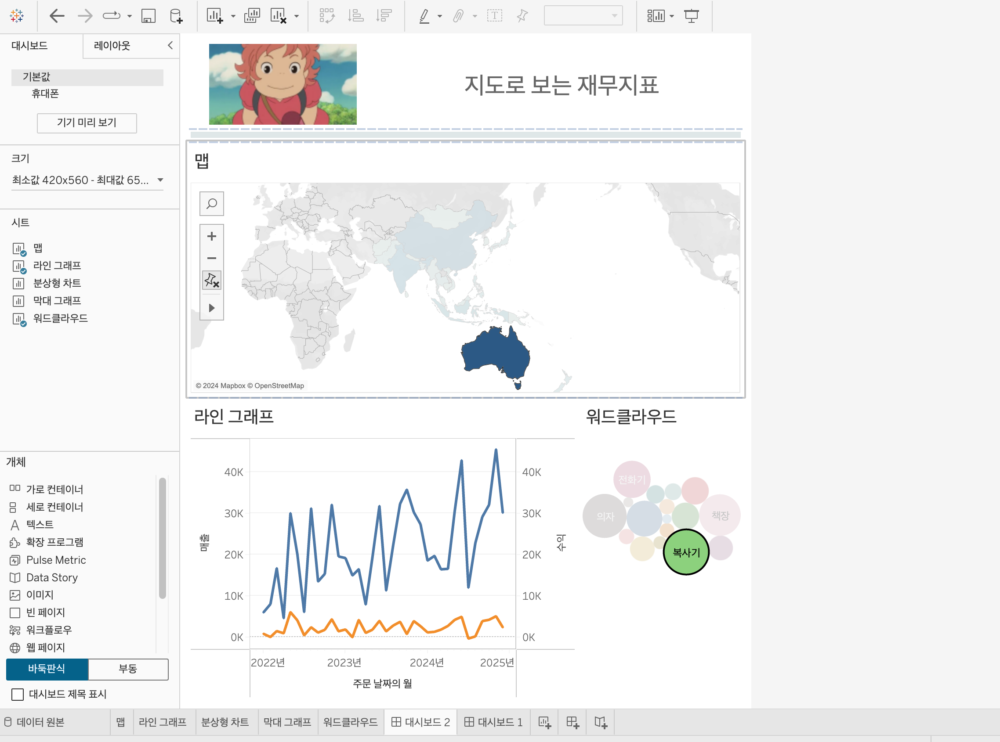
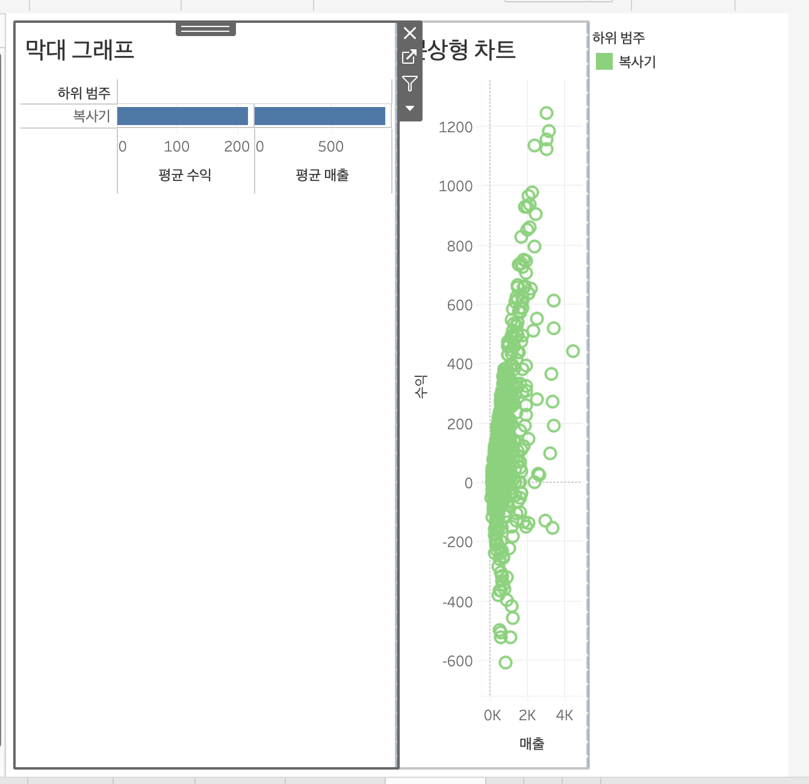

# Sixth Study Week

## Study Schedule
 

| 회차 | 강의 범위   | 강의 이수 여부 | 링크                                                                                                     |
|------|-------------|----------------|--------------------------------------------------------------------------------------------------------|
| 1    | 1~7강       | ✅              | [링크](https://www.youtube.com/watch?v=AXkaUrJs-Ko&list=PL87tgIIryGsa5vdz6MsaOEF8PK-YqK3fz&index=84)    |
| 2    | 8~17강      | ✅              | [링크](https://www.youtube.com/watch?v=AXkaUrJs-Ko&list=PL87tgIIryGsa5vdz6MsaOEF8PK-YqK3fz&index=75)    |
| 3    | 18~27강     | ✅              | [링크](https://www.youtube.com/watch?v=AXkaUrJs-Ko&list=PL87tgIIryGsa5vdz6MsaOEF8PK-YqK3fz&index=65)    |
| 4    | 28~37강     | ✅              | [링크](https://www.youtube.com/watch?v=e6J0Ljd6h44&list=PL87tgIIryGsa5vdz6MsaOEF8PK-YqK3fz&index=55)    |
| 5    | 38~47강     | ✅              | [링크](https://www.youtube.com/watch?v=AXkaUrJs-Ko&list=PL87tgIIryGsa5vdz6MsaOEF8PK-YqK3fz&index=45)    |
| 6    | 48~57강     | ✅              | [링크](https://www.youtube.com/watch?v=AXkaUrJs-Ko&list=PL87tgIIryGsa5vdz6MsaOEF8PK-YqK3fz&index=35)    |
| 7    | 58~67강     | 🍽️             | [링크](https://www.youtube.com/watch?v=AXkaUrJs-Ko&list=PL87tgIIryGsa5vdz6MsaOEF8PK-YqK3fz&index=25)    |
| 8    | 68~77강     | 🍽️             | [링크](https://www.youtube.com/watch?v=AXkaUrJs-Ko&list=PL87tgIIryGsa5vdz6MsaOEF8PK-YqK3fz&index=15)    |
| 9    | 78~85강     | 🍽️             | [링크](https://www.youtube.com/watch?v=AXkaUrJs-Ko&list=PL87tgIIryGsa5vdz6MsaOEF8PK-YqK3fz&index=5)     |
---

 
<!-- 여기까진 그대로 둬 주세요-->

> **🧞‍♀️ 오늘은 강의보다 실습과 대시보드 직접 만들기가 더 중요하니, 기록보다는 사고하며 강의를 들어주세요.**

## 48. 워크시트 서식(2)

<!-- 워크시트에 관해 본 강의에서 알게 된 점을 적어주세요 -->
서식 => 테두리 옵션    

## 49강. 대시보드패널

<!-- 대시보드패널 강의에서 알게 된 점을 적어주세요. -->
대시보드 크기 : 현 대시보드 크기 설정 가능   

## 50. 대시보드 구성방식

<!-- 알게 된 점을 적고, 아래 질문에 답해보세요 :) -->

> **🧞‍♀️ 부동과 바둑판식 방식을 차이를 중점으로 기술해보세요**
바둑판식 : 개체를 추가하면 격자무늬 구조에 따라 개체들을 구성   
부동 : 개체를 자유롭게 배치가능, 사용자가 원하는대로 추가 가능   

shift 누른채로 드래그앤드랍 => 부동식으로 추가됨.    

## 51. 대시보드 컨테이너
컨테이너를 제대로 배치했는지 확인    
=>"레이아웃"탭 클릭   

## 52. 레이아웃 패널
레이아웃 => 제목 표시/부동일 때 위치변경    
개체 테두리 옵션    
백그라운드 옵션    
바깥쪽 여백, 안 쪽 여백       

## 53. 필터 동작

<!-- 필터 동작에 대해 알게 된 점을 적어주세요 -->
1. 차트 클릭 > 필터 옵션 선택   

대시보드 동작 사용 => 더 직관적   
대시보드 동작 기능 => 대시보드 차트와 직접 상호작용 가능.   

- 동작실행조건
마우스 오버 : 차트의 마크 위에 마우스를 놓으면 나머지 데이터가 해당 마크의 데이터로 변경된다.
선택 : 차트의 마크를 클릭하면 나머지 데이터가 선택한 마크의 데이터로 변경된다.   
메뉴 : 마크를 클릭할 때 마크의 도구 설명에 텍스트가 나타나고 옵션을 선택할 때 나머지 데이터를 변경하는 것을 의미한다.    

## 54. 대시보드 하이라이터 동작

<!-- 하이라이터에 대해 알게 된 점을 적어주세요 -->
데이터 수가 많아 모든 데이터 마크 구별이 어렵기 때문에 원하는 제품의 하위 범주를 나머지 데이터와 구별하기 위해 하이라이트를 활용한다.    
- 선택 기준으로 사용하는 필드가 변경할 그래프에 포함되어 있어야 한다.     

## 55. 대시보드 URL

<!-- URL에 대해 알게 된 점을 적어주세요 -->

## 56. 대시보드 시트에 이동 동작

<!-- 대시보드 시트에 이동에 대해 알게 된 점을 적어주세요!-->

탐색개체 > 편집 버튼 

## 57. 매개변수 변경 동작

<!-- 매개변수 변경 동작에 대해 알게 된 점을 적어주세요!-->
동작 > 매개변수 변경    
 

## 문제

오늘은 별도의 문제가 없습니다. 

여러 대시보드를 참고하시어, superstore 데이터를 사용해 나만의 대시보드를 제작해주세요.

**단, 워크시트 3개 이상의 그래프를 표시해야 하며 각 시트 간 상호작용성 필터 or 하이라이트 동작은 꼭 추가되어야 합니다**

어떤 부분에 가중을 두었는지, 어떤 사용자 편의성을 고려하였는지에 대한 설명이 필요합니다.

지도의 국가를 선택하면 이에 따라 그래프 값이 바뀌도록 하였고, 라인 그래프에서 시작날짜 마지막 날짜 선정할 수 있도록 했다.    
워드클라우드로 만든 하위범주를 선택하면 선택한 하위범주의 매출과 수익을 보여주는 시트로 이동하도록 해서 사용자가 한눈에 들어온 정보에 대해 더 궁금하면 추가 정보를 제공할 수 있도록 했다.    